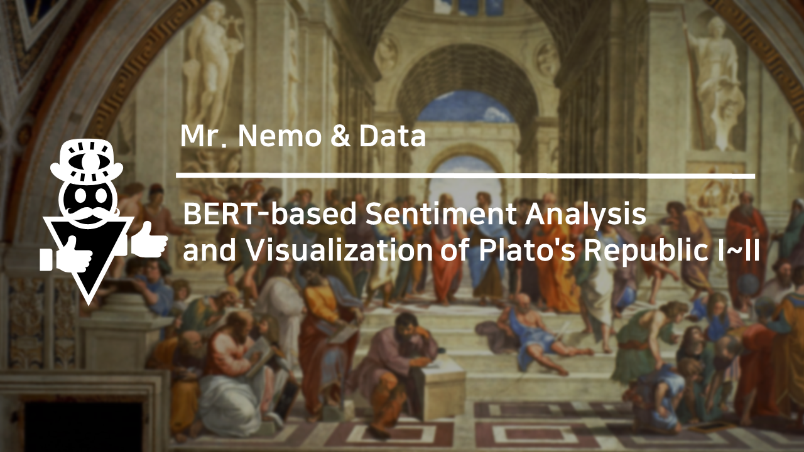

# BERT-based Sentiment Analysis and Visualization of Plato's Republic I~II

Early in The Republic  I~II, Socrates refutes the potential definitions of justice suggested by various figures such as Cephalus, Polemarchus, and Thrasymachus. Since negative emotions often accompanied these arguments, I thought conducting sentiment analysis could help contextualize the main ideas covered in The Republic. Using the BERT-based sentiment classification model provided by Huggingface's Transformers package, I attempted to extract the sentence tokens of negative sentiment and visualize their word frequencies with the Scattertext package.

analysis video - https://www.youtube.com/watch?v=rF8T6JuwuHM
